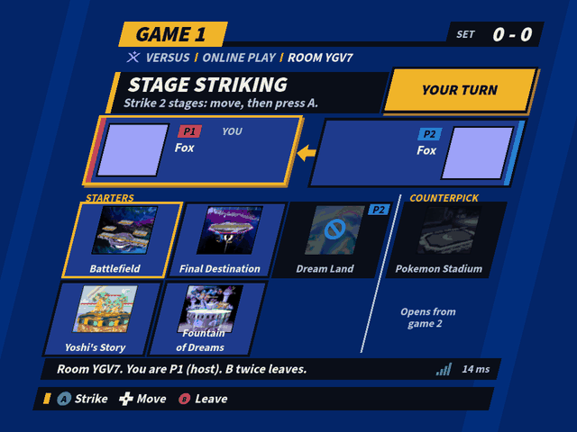
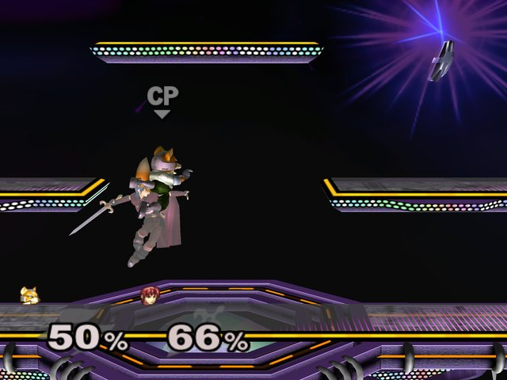
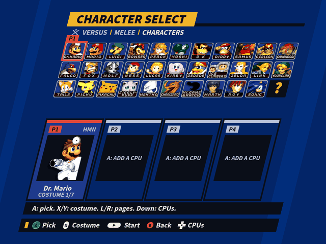
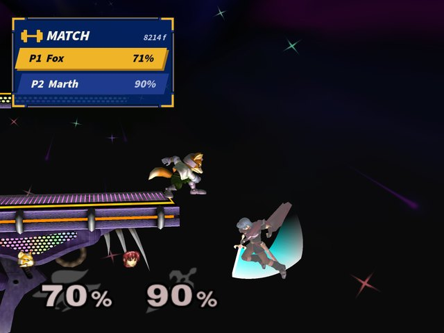

# GD's Melee — native PC port

<p align="center">
  <picture>
    <source media="(prefers-color-scheme: dark)" srcset="pc/docs/readme/brand/logo_horizontal_dark.png">
    <source media="(prefers-color-scheme: light)" srcset="pc/docs/readme/brand/logo_horizontal_light.png">
    
  </picture>
</p>

<p align="center">
  <a href="https://github.com/GurekamDhillon/gd-melee-workspace/releases/latest"></a>
  
  
  
  
  <a href="pc/LICENSE"></a>
</p>

This fork of [doldecomp/melee](https://github.com/doldecomp/melee) adds a native PC port of
*Super Smash Bros. Melee* (NTSC 1.02, `GALE01`) on the **`pc-port`** branch. It is built from the
matching decompilation — every game translation unit is real, editable C — rather than by emulation
or by statically recompiling the retail binary.

It plays online with **rollback netcode** from a competitive lobby, renders natively in HD, runs
**[m-ex](https://github.com/akaneia/m-ex) modded content** (mod discs and loose mods: fighters,
stages, items and music), and can be scripted in **Lua**.

> **Status: public test build (0.1.4).** Download it, and read the project overview, the full
> feature list and the screenshots, in the workspace repo:
> **[GurekamDhillon/gd-melee-workspace](https://github.com/GurekamDhillon/gd-melee-workspace)**
> ([latest release](https://github.com/GurekamDhillon/gd-melee-workspace/releases/latest)). You
> supply your own legally dumped disc image.

<table>
  <tr>
    <td width="50%"></td>
    <td width="50%"></td>
  </tr>
  <tr>
    <td></td>
    <td></td>
  </tr>
</table>

## What's here

- **Rollback netplay** with a room code or Random Opponent, and a competitive lobby: blind picks,
  starters and counterpicks, 1-2-1 strikes (the cursor skips struck stages), bans, ready-up and
  rematches.
- **HD rendering** at any render scale over D3D12, vsync off, an experimental uncapped frame rate,
  and about 13 ms from controller to screen.
- **m-ex content**: mod discs (ACE, Akaneia) and loose mods, **94 fighter slots**, m-ex fighters'
  names, emblems and stock icons on the results screen, and m-ex CPUs that play from their clone
  base's CPU tables.
- **New menus**: main menu, hubs, character and stage select (with pages for big rosters), a
  Settings screen, and Training through the new select screens.
- **Lua scripting and a console**, including `gd.kit` for drawing in the menus' own style over any
  scene. See the workspace repo's
  [`docs/scripting.md`](https://github.com/GurekamDhillon/gd-melee-workspace/blob/master/docs/scripting.md).
- **Slippi replay playback**, UCF and tournament rule sets, and a deterministic engine checked frame
  by frame with SyncTest.
- **Controllers play, the keyboard is hotkeys only**, with a "Connect a controller" notice when a
  window has none, and **the mouse in every menu** (`gd.mouse` for scripts).
- **Bit-exact with the console:** matrix maths rounds like the Gekko's paired singles, and real
  console Slippi replays play back matching to the bit, frame by frame.
- Recent fixes: items no longer hitch on first spawn (pipelines compiled in parallel and prewarmed),
  and crash fixes for m-ex motion tables, part trees and costume data.

### The Geno engine and LAB

**Geno** (`pc/geno/`) is native fighter content beyond m-ex, opt-in per fighter through a
`geno.json`: script variables and logic, engine values, change-action rules, new action states
(glide, Brawl-style specials), root-motion states, and model effects that follow a move. A fighter
without `geno.json` runs exactly as m-ex defines it, and everything Geno adds is in the rollback
snapshot. Melee's own physics, hitstun, knockback and ledge rules never change.

**LAB** (SOLO > LAB) is a frame-data lab game mode: display modes and overlays, a Sakurai-style pause
menu, long rewind, a savestate library and hot reload, a state browser, knockback preview, A/B
compare, frame-data export, a rollback visualiser, and vanilla-parity checks against real Slippi
replays.

The reference is [`docs/geno.md`](docs/geno.md). The first fighter built on it is **Halberd**
(Meta Knight from *Brawl*), whose research lives in the workspace repo's
[`ports/halberd/`](https://github.com/GurekamDhillon/gd-melee-workspace/tree/master/ports/halberd)
(no assets; you need your own legally obtained game files).

## What the port adds

Everything lives under [`pc/`](pc/):

```
pc/platform/   native shims: GX→Aurora, OS, PAD, CARD, AX (DSP-ADPCM mixer), DVD, AR, VI, libc,
               netplay, scripting (Lua) and the new menus,
               plus the m-ex layer: gw_ppc.c (interpreter), gw_mex_ftfunction*.c (fighters),
               gw_mex_grfunction.c (stages), gw_mex_bridge.c (guest→native call bridge)
pc/geno/       Geno (fighter extensions) and the LAB mode
pc/gameworld/  game-world code compiled through the PowerPC→x86 retarget (gekko_fp.c, mtx_pc.c)
pc/scripts/    the built-in Lua examples and console.py (the console over a local socket)
pc/tools/      gwtool (the PPC→x86 retargeter) and asset extraction
pc/build/      Windows build/link/run scripts
pc/tests/      in-engine tests, run headless against a real disc image
pc/docs/       port dev quick-reference
```

The game's own translation units are compiled for PowerPC with clang and retargeted to x86 by
`gwtool`, which keeps guest memory big-endian and provides the GameCube SDK surface through native
shims over [Aurora](https://github.com/encounter/aurora) / [Dawn](https://dawn.googlesource.com/dawn)
(D3D12). See [`pc/README.md`](pc/README.md) for the architecture.

## m-ex content support

m-ex extends Melee by shipping **PowerPC code inside its data files** — each custom fighter and
stage carries a relocatable code blob that the retail engine calls into. Natively compiled x86 has
no way to execute that, so the port runs those blobs through a small **PowerPC interpreter**
(`pc/platform/gw_ppc.c`) and bridges their calls back to the port's own native functions. Content
is read from `MxDt.dat` (m-ex's `mexData`) rather than hardcoded, so adding a fighter is a data
question, not a code one.

| Area | State |
|---|---|
| **Fighters** | Table-driven from `mexData`, up to **94** m-ex slots. Akaneia and ACE rosters load and play, locally and online. |
| **Stages** | `grFunction` plus the expanded stage tables. |
| **Items** | Custom articles work (for example Sonic's spring). |
| **Audio/menus** | Per-fighter BGM, weighted menu playlists, announcer, victory themes, results screen names, emblems and stock icons, CSS cursor scaling. |
| **CPUs** | m-ex CPUs read their clone base's rows of the CPU tables. |
| **Kirby hats** | Not implemented — every m-ex fighter currently gives Kirby the clone base's hat. |
| **Mixing packs** | Fighters and stages from different packs (ACE fighters on Akaneia stages) can't be mixed yet. |

m-ex content requires a disc (or loose mods) that carries it. A stock `GALE01` image boots fine and
simply has none.

### Development conveniences

- `MELEE_SCENE="mode=training;p1=fox"` boots straight to any screen with any configuration —
  characters, stages, CPU levels, teams, and `select=kit` for Training on the new select screens. A
  number naming a character or stage **must** say which index space it is in (`ck:`/`fk:`/`mex:`,
  `ext:`/`int:`), because the port juggles four of them.
- `MELEE_CONSOLE_PORT` opens the console on a local socket (`pc/scripts/console.py`), so tools can
  drive the game: state, input, save/load states, stepping and screenshots.
- A host-side loading overlay reports real progress during the multi-second boot read.
- In-engine tests run headless (no window, no GPU) against a real disc image, so most of the m-ex
  data layer is verified without launching the game.

## Building

See [`pc/build/README.md`](pc/build/README.md) and [`pc/docs/PORT_DEV_QUICKREF.md`](pc/docs/PORT_DEV_QUICKREF.md).
Broadly: build Aurora + Dawn + SDL3, compile each translation unit through `gwtool`, link with the
platform shims, regenerate the m-ex bridge from the link map and link again, then run
`melee-pc.exe --iso <your GALE01 v1.02 image>`. The workspace repo's `tools/port/build.sh` does the
whole sequence.

## Licence and legal

`pc/` is licensed **GPL-2.0-or-later** — see [`pc/LICENSE`](pc/LICENSE). Upstream `doldecomp/melee`
publishes no licence of its own; nothing here re-licences the decompilation. `pc/gameworld/gekko_fp.c`
derives in part from Dolphin Emulator's `Common/FloatUtils.cpp` (GPL-2.0-or-later) and carries an
attribution header.

**No copyrighted game material is distributed here.** You must supply your own legally dumped disc
image. Nothing in this repository contains disc data: no `.iso`, `.dol`, `.dat`, `.usd`, `.ssm`,
`.sem`, `.hps`, `.thp` or `.gci` files are tracked, and `.gitignore` refuses them. The screenshots
above show the port running on the author's own discs.

**m-ex is treated as a specification only.** m-ex publishes no licence, so none of its sources,
headers or data files are vendored or redistributed here; the support described above is an
independent reimplementation in original C of its published behaviour and file formats. Modded
content itself — Akaneia, ACE or any other build — is not distributed and must be supplied by you.

Not affiliated with, endorsed by or sponsored by Nintendo; *Super Smash Bros.* and *Melee* are
trademarks of Nintendo.

Dependencies — including the vendored Aurora and its port patches — are inventoried in
[`pc/DEPENDENCIES.md`](pc/DEPENDENCIES.md).

## Credits

[doldecomp/melee](https://github.com/doldecomp/melee) · [encounter/aurora](https://github.com/encounter/aurora) ·
[google/dawn](https://dawn.googlesource.com/dawn) · [TwilitRealm/dusklight](https://github.com/TwilitRealm/dusklight) ·
[akaneia/m-ex](https://github.com/akaneia/m-ex) · Dolphin Emulator.
